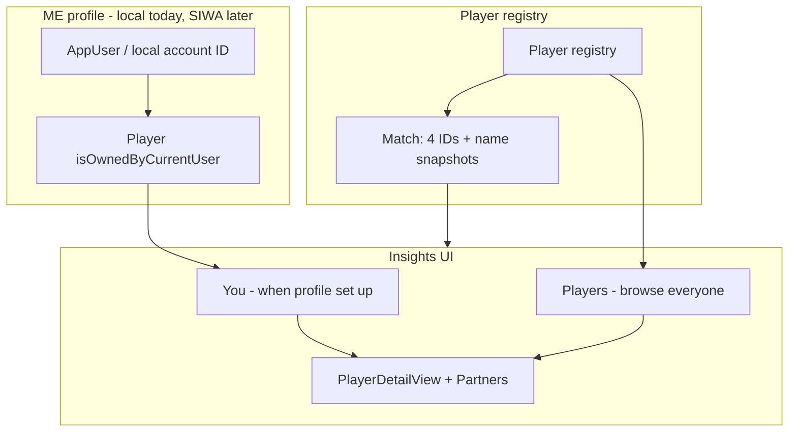

> **Archive note:** Phases 1–3 (four player names, player registry, per-player Insights, local ME profile) shipped in **`0.6e`**. This document lists **remaining work only**.

# Four players + Insights — future backlog

## Shipped (0.6c–0.6e)

| Area | Status |
|------|--------|
| Four player name fields on Match + sync codec | ✅ |
| Display helpers (`sideLabel`, legacy team names) | ✅ |
| New Match / Live / Detail / History player-aware labels | ✅ |
| `Player` registry, `findOrCreate`, match roster IDs | ✅ |
| Insights: Overview + Players list + `PlayerDetailView` | ✅ |
| Per-player stats + golden-point conversion | ✅ |
| Partner stats on player profiles | ✅ |
| Name autocomplete on New Match | ✅ |
| Local ME profile (Settings → Account) | ✅ |
| You section in Insights, New Match pre-fill, preferred slot | ✅ |
| Link past matches dialog | ✅ |
| PadelCore tests (54+) | ✅ |

**Personal Team constraint:** Sign in with Apple entitlement is **not** available on a free Apple ID. The app uses a **local profile** (`AuthCapabilities.supportsSignInWithApple = false`) until M8 enrollment.

---

## 1. Sign in with Apple (M8 — blocked on Personal Team)

**Prerequisite:** Apple Developer Program enrollment + paid-team signing.

**Steps when ready:**

1. Add `com.apple.developer.applesignin` to [PadelNote.entitlements](../../PadelNote/PadelNote.entitlements) and enable the capability on the App ID in Xcode.
2. Set `AuthCapabilities.supportsSignInWithApple = true` in [AuthCapabilities.swift](../../PadelNote/Services/AuthCapabilities.swift).
3. Verify [AccountAuthSection.swift](../../PadelNote/Views/AccountAuthSection.swift) SIWA button path on a real device.
4. Test credential state restore via [CurrentUserStore.swift](../../PadelNote/Services/CurrentUserStore.swift) + [AuthSessionStore.swift](../../PadelNote/Services/AuthSessionStore.swift).

**Already wired:** `AppUser`, `UserAccountPersistence`, Keychain session, SIWA handler in `CurrentUserStore`, first-sign-in creates owned `Player`.

**Migration note:** Local profiles use `local.<UUID>` account IDs. Decide whether to offer “Upgrade to Sign in with Apple” and merge/link the existing owned `Player`, or treat as a fresh sign-in.

---

## 2. CloudKit private database sync (v1.1 — after SIWA)

**Prerequisite:** Sign in with Apple + ME profile stable on phone (§1).

**Scope:**

- Switch `ModelContainer` to `ModelConfiguration(cloudKitDatabase: .private)` in [PadelNoteApp.swift](../../PadelNote/PadelNoteApp.swift).
- Sync `AppUser`, ME-linked `Player`, `Match`, `StoredPointEvent` across iPhone(s) on the same iCloud account.
- Opponent `Player` records stay device-local (no shared global directory).
- Conflict policy: last-write-wins on match metadata; point events append-only.

**Does not start until:** SIWA verified on TestFlight devices.

---

## 3. Watch ME support (after CloudKit)

**Prerequisite:** §2 CloudKit sync complete and verified on real devices.

**Why deferred:** ME identity must be stable across devices before Watch consumes it; avoids building Watch ME twice (local-only, then iCloud).

### 3.1 Phone → Watch ME sync

Extend [PhoneSyncCoordinator.swift](../../PadelNote/Services/PhoneSyncCoordinator.swift) (same pattern as `defaultRules`):

```swift
struct MeProfilePayload {
    let playerID: UUID
    let displayName: String
    let preferredSlot: PlayerSlot?
}
```

Publish on: app launch, profile setup/sign-out, rename, preferred slot change. Watch stores in UserDefaults; sign-out clears ME on next sync.

### 3.2 Watch match start + save

- [WatchStartView.swift](../../PadelNoteWatch/Views/WatchStartView.swift) / [WatchMatchCoordinator.swift](../../PadelNoteWatch/WatchMatchCoordinator.swift): pre-fill ME slot when profile present.
- [WatchMatchCoordinator.swift](../../PadelNoteWatch/WatchMatchCoordinator.swift): include `player*Name` + `player*ID` in transfer payload (at minimum ME slot).
- [WatchLiveMatchView.swift](../../PadelNoteWatch/Views/WatchLiveMatchView.swift): show `sideLabel(for:)` when names present.
- [WatchLiveMirrorView.swift](../../PadelNote/Views/WatchLiveMirrorView.swift): show player names when synced.

**Explicitly out of scope for Watch ME:** Sign in with Apple on Watch; full four-name entry UI on Watch; CloudKit on Watch independent of phone.

### 3.3 Tests

- ME payload encode/decode in [SyncPayloadCodec.swift](../../PadelCore/Sources/PadelCore/Sync/SyncPayloadCodec.swift).
- Watch coordinator pre-fills ME slot; save payload includes `playerID`.
- Sign-out on phone clears Watch ME on next connectivity event.

---

## 4. App Store + privacy (M9)

Before submission with SIWA / CloudKit:

- Host privacy policy URL (GitHub Pages — see README M9).
- Update App Privacy questionnaire: optional account, Apple ID for auth, Health data, iCloud container when CloudKit ships.
- App Store description: account optional for scoring; ME personalization optional; data on-device / user's iCloud (not our servers).

---

## Out of scope (future / v1.1+)

- Head-to-head rival stats between two specific players
- Per-player point attribution (scoring stays team-level)
- Email/password or social logins beyond Apple
- Global player directory / finding friends
- Player merge/rename UI

---

## Reference — architecture (shipped)


