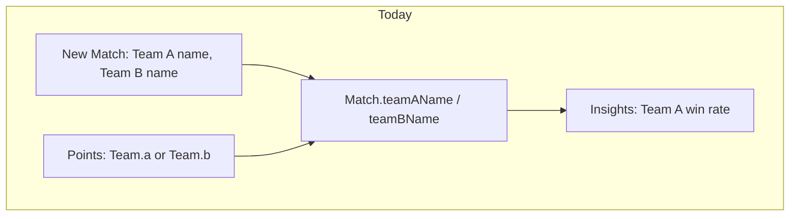
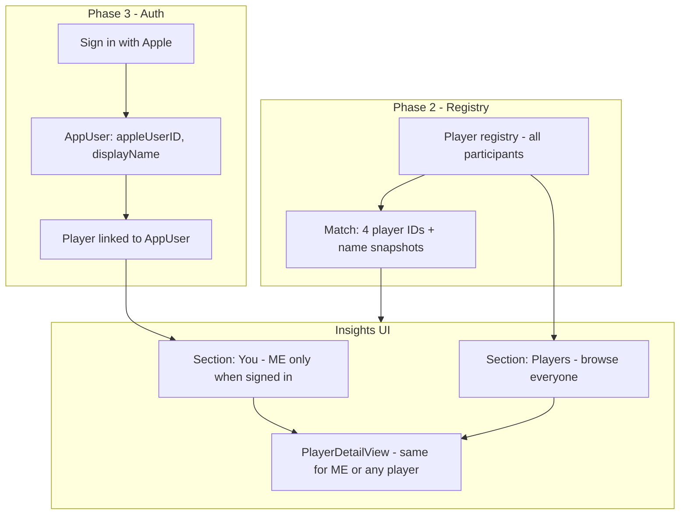
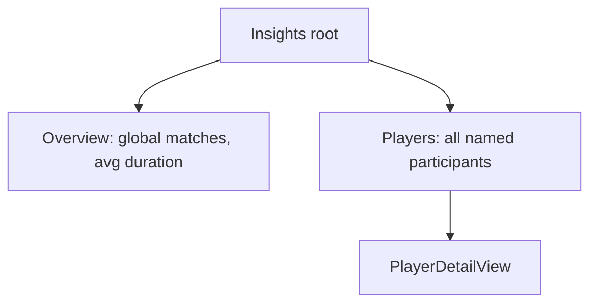
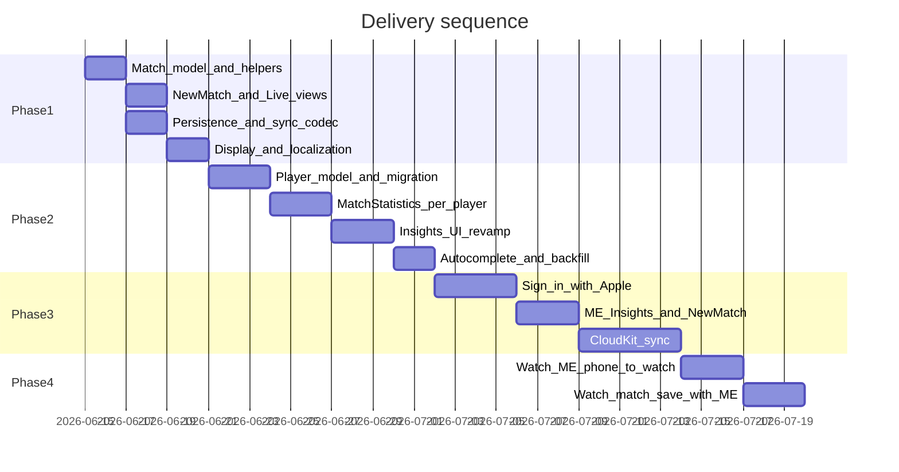

> **Archive note:** Saved from Cursor plan mode. File paths in links are relative to the repository root.

# Four-player names, per-player Insights, and ME profile

## Current state

Today the app is **team-centric**, not player-centric:

- [NewMatchSetupView.swift](PadelNote/Views/NewMatchSetupView.swift) captures two optional strings (`teamAName`, `teamBName`).
- [Match.swift](PadelCore/Sources/PadelCore/Persistence/Match.swift) stores `teamAName` / `teamBName`; points only record `Team.a` / `Team.b`.
- [ScoringEngine](PadelCore/Sources/PadelCore/Engine/ScoringEngine.swift) stays binary—no change needed for scoring.
- [StatsView](PadelNote/Views/StatsView.swift) shows **global** metrics biased to "Team A" via [MatchStatistics](PadelCore/Sources/PadelCore/Stats/MatchStatistics.swift).
- Watch matches always save with `nil` names; labels are hardcoded "Team A" / "Team B".
- [README.md](README.md) currently says **no account required** (privacy pillar D-09 area)—this plan introduces **optional Sign in with Apple** for ME; README and privacy policy must be updated before App Store.



---

## Product decisions (confirmed)

| Decision | Choice |
|----------|--------|
| Player stats | **Browsable for every named player** — equal detail in `PlayerDetailView` |
| ME profile | **Sign in with Apple** — registered identity tied to Apple ID |
| ME vs others in Insights | ME gets a **prominent "You" section** when signed in; full player list remains below |
| App without account | Scoring + history still work unsigned; ME personalization and cloud identity require sign-in |
| Delivery | **Phased** — four names → Player registry + Insights → Sign in with Apple + ME + CloudKit → Watch ME |
| Watch ME | **After CloudKit sync** — phone pushes ME to Watch; Watch-started matches link to your profile |

---

## Target architecture



---

## Phase 1 — Four player names (setup, storage, display)

**Goal:** Replace team name fields with four individual player name fields while keeping scoring unchanged.

### 1.1 Data model (PadelCore)

Extend `Match` with four optional name fields: `playerA1Name`, `playerA2Name`, `playerB1Name`, `playerB2Name`.

- Keep `teamAName` / `teamBName` **temporarily** for backward compatibility during migration.
- Add helpers on `Match`:
  - `players(for team: Team) -> [String]` — non-empty names for a side
  - `sideLabel(for team: Team) -> String` — e.g. `"Alex · Maria"` with localized fallback to `"Team A"` when all empty
  - Update `teamName(for:)` to delegate to `sideLabel(for:)`

**Migration policy for old matches:**
- If new fields are empty but `teamAName` / `teamBName` exist → treat legacy team string as **side label only** (display), not as two parsed players.
- Matches with no names continue to show localized "Team A" / "Team B".

### 1.2 Sync payloads

Update [MatchTransferPayload](PadelCore/Sources/PadelCore/Sync/MatchTransferPayload.swift), [LiveScoreSnapshot](PadelCore/Sources/PadelCore/Sync/LiveScoreSnapshot.swift), and [SyncPayloadCodec](PadelCore/Sources/PadelCore/Sync/SyncPayloadCodec.swift) with four optional player name keys.

- Watch can keep sending `nil` in Phase 1 (no Watch UI change required yet).
- Codec must remain backward-compatible with older payloads that only have `teamAName` / `teamBName`.

### 1.3 New Match UI

Revamp [NewMatchSetupView.swift](PadelNote/Views/NewMatchSetupView.swift):

```
Players (optional)
  Side A
    Player 1  [TextField]
    Player 2  [TextField]
  Side B
    Player 1  [TextField]
    Player 2  [TextField]
```

- All fields optional (padel can still be scored anonymously).
- Pass four strings into [LiveMatchView](PadelNote/Views/LiveMatchView.swift).
- Update [MatchPersistence.saveCompletedMatch](PadelCore/Sources/PadelCore/Persistence/MatchPersistence.swift) and `saveTransferredMatch`.

### 1.4 Display surfaces

| Surface | Change |
|---------|--------|
| [LiveMatchView](PadelNote/Views/LiveMatchView.swift) | Side buttons show combined player names |
| [MatchDetailView](PadelNote/Views/MatchDetailView.swift) | Winner + timeline use side/player labels |
| [MatchRowView](PadelNote/Views/MatchRowView.swift) | Winner line uses player-aware label |
| [MatchFormatting](PadelCore/Sources/PadelCore/Persistence/MatchFormatting.swift) | `winnerLabel(for:)` uses new helpers |
| [WatchLiveMatchView](PadelNoteWatch/Views/WatchLiveMatchView.swift) | Unchanged in Phase 1 |

### 1.5 Localization + tests

- Update [Localizable.xcstrings](PadelNote/Localizable.xcstrings) for player/side copy + Spanish.
- Unit tests for `sideLabel`, partial names, legacy migration, persistence round-trip.

**Phase 1 explicitly does not:** Player registry, auth, or Insights changes.

---

## Phase 2 — Unique players + Insights revamp

**Goal:** Stable player identity across matches; Insights becomes a hub to browse stats for **any** player.

### 2.1 Player entity (SwiftData)

```swift
@Model
final class Player {
    @Attribute(.unique) var id: UUID
    var displayName: String
    var normalizedName: String   // trim + case-fold for dedup
    var createdAt: Date
    var isOwnedByCurrentUser: Bool  // true only for ME-linked Player (set in Phase 3)
}
```

**Uniqueness rule:** one `Player` per `normalizedName` for opponents/partners entered by name. ME's Player is created explicitly at sign-up (Phase 3) and is **not** deduped against free-text names unless user confirms a link.

**Match linkage** — identity + snapshot on `Match`:

```swift
var playerA1ID: UUID?; var playerA1Name: String?
// ... A2, B1, B2
```

### 2.2 Player resolution at match save

1. For each non-empty name field → `findOrCreatePlayer(displayName:)` (skip if slot already has a selected Player ID from autocomplete).
2. Write four `player*ID` + `player*Name` snapshots on `Match`.
3. Backfill migration for existing named matches.

### 2.3 Stats input + computation

Extend [MatchSummary](PadelCore/Sources/PadelCore/Stats/MatchSummary.swift) with roster (`sideA` / `sideB` player IDs).

**Win rule (same for every player):**
- A player **wins** if on the winning side.
- Golden-point conversion attributed to the **side** the player was on during that match.

New PadelCore APIs in [MatchStatistics](PadelCore/Sources/PadelCore/Stats/MatchStatistics.swift):

| API | Purpose |
|-----|---------|
| `playerSummaries(for matches:)` | List DTO: match count, wins, losses, win rate per `Player` |
| `insights(for playerID:, matches:)` | Duration, golden-point conversion for one player |
| `partnerStats(for playerID:)` | Optional Phase 2b: co-player win rates |

### 2.4 Insights UI revamp

Replace flat [StatsView](PadelNote/Views/StatsView.swift):



**Insights root (Phase 2 — unsigned)**
- **Overview** — global metrics; remove Team A/B bias and footer note.
- **Players** — every `Player` sorted by match count; tap for full stats.
- **Sign-in prompt** — subtle CTA: *"Sign in to track your personal stats"* (leads to Phase 3).

**Player detail** (`PlayerDetailView`) — **identical experience for every player:**
- Win rate, W–L, avg duration, golden-point conversion
- Recent matches involving this player
- Optional: partners subsection (Phase 2b)

### 2.5 New Match UX (Phase 2)

- Autocomplete from `Player` registry when typing names.
- Free-text creates a new `Player` on save (opponents/partners).

---

## Phase 3 — Sign in with Apple + ME profile

**Goal:** Registered identity for the account holder; ME stats highlighted, but **all player stats remain browsable**.

### 3.1 Auth stack

Use **Sign in with Apple** (`AuthenticationServices`):

```swift
@Model
final class AppUser {
    @Attribute(.unique) var appleUserID: String   // opaque Apple identifier
    var displayName: String
    var email: String?          // only if Apple shares it
    var playerID: UUID          // links to ME's Player record
    var createdAt: Date
    var lastSignedInAt: Date
}
```

**Services to add:**
- `AuthService` / `SignInWithAppleCoordinator` — ASAuthorizationController flow, credential state check on launch
- Keychain storage for session token / user ID (Apple best practice)
- `CurrentUserStore` (`@Observable`) — exposes signed-in `AppUser?` app-wide

**Registration vs login:** Single Sign in with Apple flow handles both first-time and returning users. On first sign-in:
1. Create `AppUser` + linked `Player` with Apple-provided or user-chosen display name.
2. Set `Player.isOwnedByCurrentUser = true`.

### 3.2 App entry + gating

| State | Behavior |
|-------|----------|
| Not signed in | Full app works (score, history, browse all player stats). ME section hidden; sign-in CTA in Insights + Settings. |
| Signed in | ME section visible; New Match can pre-fill user's name; profile in Settings. |

No hard paywall on core scoring—aligns with keeping the app usable without account until user wants personalization.

### 3.3 ME in Insights (signed in)

Add **"You"** section above the all-players list:

```
Insights
├── You                    ← only when signed in
│   Win rate, matches, golden point (same metrics as PlayerDetail)
│   [View full profile →]
├── Overview               ← global
└── Players                ← everyone, including ME (ME also appears here)
    Alex        12 matches  58%
    Maria        8 matches  50%
    ...
```

- Tapping ME in either section opens the same `PlayerDetailView`.
- No stat is exclusive to ME—**You** is a convenience shortcut, not a separate data model.

### 3.4 ME in New Match (signed in)

- Pre-fill one player slot with ME's display name + linked `playerID` (user picks side and position: A1, A2, B1, or B2).
- Remember last-used slot in UserDefaults.
- Other three slots: autocomplete or free-text as in Phase 2.

### 3.5 Linking ME to past matches (optional backfill)

After first sign-in, offer: *"Link past matches where your name appears?"*
- Fuzzy match on `normalizedName` against historical `player*Name` fields.
- User confirms before rewriting `player*ID` on old matches.
- Declining leaves history unchanged; only new matches auto-link ME.

### 3.6 Cloud + privacy (aligns with README D-05)

Sign in with Apple is the on-ramp to CloudKit private DB sync (detailed in **§3.9**).

- **README / privacy policy updates required:**
  - Account is optional for scoring; required only for ME personalization
  - Apple ID used for authentication; data in user's private iCloud container
  - App Store review: Sign in with Apple entitlement + hosted privacy policy URL (M9)

### 3.7 Settings additions

- **Account** section: sign in / sign out, display name, linked player
- Sign out clears session but **keeps local match history** (ME slot becomes a normal Player entry until re-linked)

### 3.8 Tests

- Auth flow mocks (credential state, first sign-in creates AppUser + Player)
- ME pre-fill on New Match
- Insights shows You section only when signed in
- Player detail parity: ME vs opponent same metrics

### 3.9 CloudKit sync (prerequisite for Phase 4)

Full **CloudKit private database** sync via `ModelConfiguration(cloudKitDatabase: .private)`:

- Sync `AppUser`, ME-linked `Player`, `Match`, and `StoredPointEvent` across iPhone(s) signed into the same iCloud account.
- Opponent `Player` records remain device-local (no shared global directory).
- Conflict resolution: last-write-wins on match metadata; point events append-only.
- Enable only after Sign in with Apple + ME profile ship and are stable on phone.

**Phase 4 does not start until CloudKit sync is implemented and verified on real devices.**

---

## Phase 4 — Watch ME support (after CloudKit)

**Goal:** Watch-started matches count toward ME stats by syncing your profile from iPhone and attaching your identity when saving from Watch.

**Prerequisite:** Phase 1 (four player fields), Phase 3 (ME profile), and Phase 3.9 (CloudKit sync) complete.

### 4.1 Why after CloudKit

- ME identity (`AppUser` + linked `Player`) must be stable and available across devices before Watch consumes it.
- CloudKit ensures phone and any secondary iPhone share the same ME `playerID`; Watch receives a single canonical profile from the paired phone.
- Avoids building Watch ME sync twice (once for local-only auth, again after iCloud).

### 4.2 Phone → Watch ME sync

Extend existing WatchConnectivity channel (same pattern as `defaultRules` in [PhoneSyncCoordinator](PadelNote/Services/PhoneSyncCoordinator.swift)):

```swift
struct MeProfilePayload {
    let playerID: UUID
    let displayName: String
    let preferredSlot: PlayerSlot?   // A1, A2, B1, B2 — from phone UserDefaults
}
```

- Phone publishes on: app launch, sign-in, sign-out, profile rename, preferred slot change.
- Watch persists locally in `MatchRulesPreferences`-style store (Watch UserDefaults).
- Sign-out on phone clears ME on Watch on next sync.

### 4.3 Watch match start

Update [WatchStartView](PadelNoteWatch/Views/WatchStartView.swift) / [WatchMatchCoordinator](PadelNoteWatch/WatchMatchCoordinator.swift):

- If ME profile present → pre-fill configured slot with `playerID` + `displayName`.
- Other three slots remain empty (optional future: sync recent opponents from phone).
- User can change side/slot on Watch before starting (compact picker).

### 4.4 Watch live + save

- [WatchLiveMatchView](PadelNoteWatch/Views/WatchLiveMatchView.swift): show `sideLabel(for:)` when any names present; ME name on their side.
- [WatchMatchCoordinator.makeTransferPayload](PadelNoteWatch/WatchMatchCoordinator.swift): include four `player*Name` + `player*ID` fields (at minimum ME slot populated).
- [LiveScoreSnapshot](PadelCore/Sources/PadelCore/Sync/LiveScoreSnapshot.swift): include player names for iPhone live mirror.
- Phone [WatchLiveMirrorView](PadelNote/Views/WatchLiveMirrorView.swift): optionally show player names when synced.

### 4.5 Stats impact

- Watch-saved matches with ME linked → count in **You** section and per-player Insights.
- Matches started before Phase 4 remain anonymous unless user edits names on phone (future enhancement).

### 4.6 Explicitly not in Phase 4

- Sign in with Apple **on Watch** (phone is auth source; Watch trusts paired phone sync).
- Full four-name entry UI on Watch (ME auto-fill only; opponents still unnamed unless typed later on phone).
- CloudKit sync directly on Watch independent of phone.

### 4.7 Tests

- ME payload encode/decode in [SyncPayloadCodec](PadelCore/Sources/PadelCore/Sync/SyncPayloadCodec.swift).
- Watch coordinator pre-fills ME slot; save payload includes `playerID`.
- Sign-out on phone clears Watch ME on next connectivity event.

---

## What stays unchanged

- **Scoring engine** — `Team.a` / `Team.b` only; no per-player point attribution.
- **Point timeline** — team-level scoring events.
- **Health/workout data** — match-level; tied to Watch session, not individual players.

---

## Suggested implementation order



---

## Risks and edge cases

| Risk | Mitigation |
|------|------------|
| README "no account required" conflict | Reframe: account optional; scoring free without sign-in |
| ME name ≠ name typed in old matches | Offer link-backfill; don't auto-merge without consent |
| Duplicate opponents ("Alex" vs "alex") | Normalized dedup for non-ME players only |
| Apple hides email / name on repeat sign-in | Store on first auth; Keychain persistence |
| Watch matches without names | Resolved in Phase 4 (after CloudKit); until then Watch saves stay anonymous |
| Sign in with Apple + CloudKit complexity | Phase 3a = auth; Phase 3.9 = CloudKit; Phase 4 = Watch ME |

---

## Out of scope (future / M10)

- Head-to-head rival stats between two specific players
- Per-player point attribution
- Email/password or social logins beyond Apple
- Global player directory / finding friends
- Player merge/rename UI (manual merge v1.1+)
